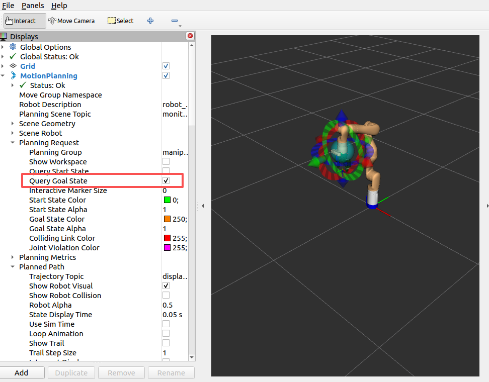

# 安装说明

ros 要求 humble

python 包主要是 unified_planning 这个库。其余的包，如果运行出问题再安装

1. 第一次所有包编译使用以下命令编译，之后可以直接使用 `colcon build`

```bash
colcon build --cmake-args -DPROTOBUF_PROTOC_EXECUTABLE=/usr/bin/protoc
```

2. 编译会报错：

```
/home/lk/workspace/src/hyy_actions/scripts/moveJs_action.cpp:43:10: fatal error:
moveit/move_group_interface/move_group_interface_improved.h: 没有那个文件或目录
```

解决：
（move_group_interface_improved.h 这个文件已经在当前目录，只需要这个移动到对应的目录中 ,将 `/home/lk/workspace` 换成你自己的路径）
```bash
sudo mv /home/lk/workspace/src/move_group_interface_improved.h \
        /opt/ros/humble/include/moveit/move_group_interface/
```


---

# 启动机器人界面

gazebo + moveit 仿真（gen3 机械臂 + robotiq85 + vision）：

```bash
# 默认（不启动 RViz）
ros2 launch kortex_bringup kortex_sim_moveit_control.launch.py

# 同时启动 RViz
ros2 launch kortex_bringup kortex_sim_moveit_control.launch.py launch_rviz:=true
```

勾选 Query Goal State

单 gazebo 仿真环境：

```bash
ros2 launch kortex_bringup kortex_sim_control.launch.py
```

真机使用：

```bash
ros2 launch kortex_bringup kortex_real.launch.py
```

启动相机话题发布：

```bash
ros2 launch kinova_vision kinova_vision.launch.py
```

---

# 控制机器人

**真机：**

```bash
ros2 run kortex_bringup arm_demo.py
ros2 run kortex_bringup arm_gripper_demo.py
ros2 run kortex_bringup arm_gripper_visual_demo.py
ros2 run kortex_bringup arm_objectdet_demo.py
```

**仿真：**

```bash
ros2 run kortex_bringup grasp_green_battery.py       # 抓绿色电池
ros2 run kortex_bringup arm_sim_demo.py
ros2 run kortex_bringup arm_gripper_sim_demo.py
ros2 run kortex_bringup arm_gripper_visual_sim_demo.py
ros2 run kortex_bringup arm_objectdet_sim_demo.py
```
